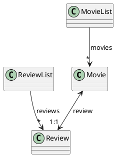
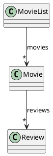
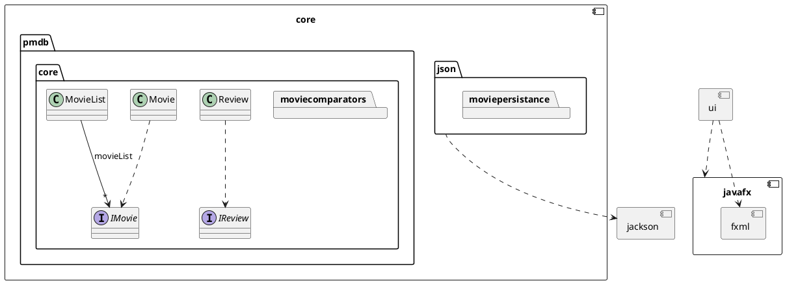

# Release 2
## Endringer fra release 1
### Endring i kjernelogikken

#### Strukturen i release 1
I release 1 var tanken at vi skulle ha både ha en klasse for *liste med anmeldelser* (`ReviewList.java`) og en for *liste med filmer* (`MovieList.java`). Hver *film* skulle bare ha én *anmeldelse*. 

Det var et *én-til-én* forhold mellom `Movie` og `Review`.    `ReviewList` hadde *én-til-mange* forhold med `Review`, det samme hadde `MovieList` med `Movie`. Se uml-diagram under. Vi benyttet oss av denne strukturen, fordi vi tenkte at det ville gjøre lagringen lettere. Tanken var at vi skulle ha to filer, en for lagring av `ReviewList` og en for lagring av `MovieList`. Dette matchet også hvordan ui-et ville være da vi skulle ha én fane for å vise *listen med anmeldelser* (`ReviewList`) og én for *listen med filmer* (`MovieList`).

Slik så klassestrukturen ut i release 1

#### Strukturen i release 2
Vi fant ut at denne klassestrukturen var ugunstig, fordi vi så at det var overflødig å både ha `ReviewList` og `MovieList`. Vi tenkte også at det skulle være mulig for en bruker å lage flere *anmeldelser* til én *film*. Derfor endret vi klasseforholdet til at `Movie` hadde *en-til-mange* forhold med `Review`. Dermed kunne vi droppe `ReviewList` og istedenfor la `MovieList` inneholde mange `Movies` som igjen inneholder mange `Reviews`. Da kunne vi også lagre alt i en fil. Hvis vi vil ha tak i en `Review` trenger vi bare å finne den tilhørende filmen.

Slik ser klassestrukturen ut nå.

### Lagring
Vi har valgt å bruke desktoplagring når vi lagrer
I release 1 hadde vi en mer automatisk lagring. Vi sendte inn hele javaobjektet vi ville lagre, og lot JSON gjøre jobben for oss. Vi fant ut at dette var en ugunstig måte å gjøre det på da vi ikke hadde noe kontroll over hvordan objektet ble lagret. Dette gjorde det også vanskelig å teste lagring. 