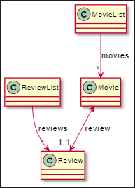
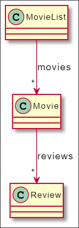
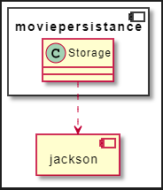
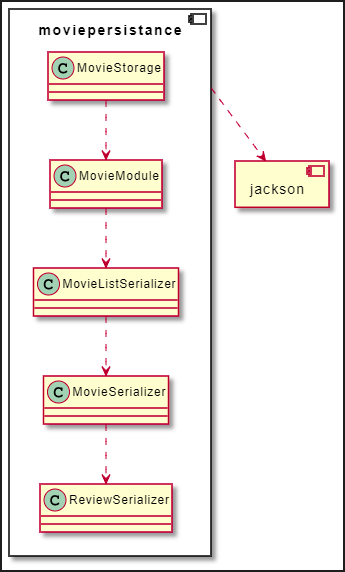
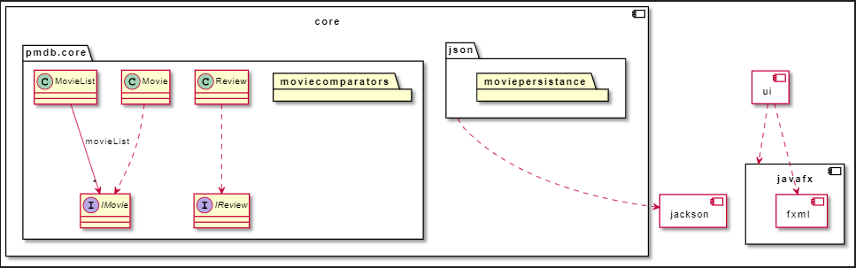

# Release 2
Dokumentasjon for release 2:

- [Endringer i klassestruktur](#endring-i-klassestrukturen)
- [Endring i JSON-lagring](#endringer-i-json-lagringen)
- [Dokument metafor](#dokumentmetafor)
- [Arkitektur](#arkitektur)
- [Arbeidsvaner](#arbeidsvaner)
- [Tester](#tester)
- [Checkstyle](#checkstyle) 

## Endring i klassestrukturen

### Strukturen i release 1

I release 1 var tanken at vi skulle ha både ha en klasse for _liste med anmeldelser_ (`ReviewList.java`) og en for _liste med filmer_ (`MovieList.java`). Hver _film_ skulle bare ha én _anmeldelse_.

Det var et _én-til-én_ forhold mellom `Movie` og `Review`. `ReviewList` hadde _én-til-mange_ forhold med `Review`, det samme hadde `MovieList` med `Movie`. Se uml-diagram under. Vi benyttet oss av denne strukturen, fordi vi tenkte at det ville gjøre lagringen lettere. Tanken var at vi skulle ha to filer, en for lagring av `ReviewList` og en for lagring av `MovieList`. Dette matchet også hvordan ui-et ville være da vi skulle ha én fane for å vise _listen med anmeldelser_ (`ReviewList`) og én for _listen med filmer_ (`MovieList`).

---

### Strukturen i release 2

Vi fant ut at denne klassestrukturen var ugunstig, fordi vi så at det var overflødig å både ha `ReviewList` og `MovieList`. Vi tenkte også at det skulle være mulig for en bruker å lage flere _anmeldelser_ til én _film_. Derfor endret vi klasseforholdet til at `Movie` hadde _en-til-mange_ forhold med `Review`. Dermed kunne vi droppe `ReviewList`, og istedenfor la `MovieList` inneholde mange `Movies` som igjen inneholder mange `Reviews`. Da kunne vi også lagre alt i en fil. Hvis vi vil nå ha tak i en `Review`, trenger vi bare å finne den tilhørende filmen.

|                        Struktur release 1                        |                        Struktur release 2                        |
| :--------------------------------------------------------------: | :--------------------------------------------------------------: |
|  |  |

---
## Endringer i JSON-lagringen

I release 1 hadde vi bare en klasse for lagring `Storage.java`, som benyttet `jackson` sine metoder for lagring. Vi sendte inn hele `movielist`-objektet vi ville lagre, og lot `jackson` lagre dette automatisk. Vi fant ut at dette var en ugunstig, da vi ikke hadde noe kontroll over hvordan objektet ble lagret. Vi visste ikke hvordan JSON-filen ville se ut, som skapte trøbbel da vi skulle hente hente ut objektet. Dette gjorde det også vanskelig å teste lagring, fordi vi egentlig ikke visste hvordan objektet ville se ut. Vi byttet dermed til en mer manuell lagring der vi selv bestemte hva som skulle lagres, og hvilke JSON-objekter det vil lagres som. Vi fikk da større kontroll over hvordan JSON-filen ville se ut, og testingen ble mer valid.

|                            Persistense release 1                            |                            Persistense release 2                            |
| :-------------------------------------------------------------------------: | :-------------------------------------------------------------------------: |
|  |  |

---
## Dokumentmetafor

Vi har valgt å bruke dokumentmetafor når vi lagrer. Når brukeren skal opprette et _film-objekt_, må han trykke på lagre-knappen for at det skal vises på skjermen og lagret til fil. Det samme gjelder for når brukeren oppretter en _anmeldelse_. Brukeren har mulighet for å både endre på en eksisterende _film_ eller _anmeldelse_. Endringene i objektene vil først bli utrettet når man har trykket på lagre-knappen. Som gjør at det er brukt dokumentmetafor. Vi benyttet oss av dokumentmetafor, for å gi brukeren innsikt i hva som blir lagret, og større kontroll. For brukeren er det lett å forstå at _film-objektet_ blir lagret når personen trykker på lagre-knappen og pop-up-en lukkes. Brukeren kan også se at _filmen_ dukker opp på skjermen etterpå. Når man lukker programmet har appen allerede lagret alle _filmene_ og _anmeldelsene_ til fil, ettersom at brukeren ha opprettet de underveis. Så brukeren trenger ikke å trykke på en lagre knapp før personene kan lukke appen for at ting skal bli lagret. Dette bryter litt med dokumentmetafor, men vi tenkte at denne lagringen var naturlig å skje automatisk.

## Arkitektur

Vi har benyttet oss en flermodulær arkitektur. Vi har modulene `core` og `ui`. Modulene er skiller backend fra frontend. I `core` ligger alt som har med backend å gjøre. Der ligger logikken i en undermappe `core`, og lagringen i en undermappe `json`. I `ui` modulen ligger _kontrollerklassene_ og _fxml-filene_. Vi valgte å skille `core` fra `ui`, fordi de utfører ulike oppgaver i appen. Hver modul har en `module-info` klasse som definerer hvilke moduler som denne modulen krever, og hvilke pakker inni modulen som er synlig for andre moduler. Dette skaper en god innkapsling. `ui` krever også en del moduler som ikke er nødvendig i `core`, noe som gjør det unødvendig for `core` å importere. Modulariseringen danner også et tydeligere _model-view-controller_ skille, som er ønskelig.

Under ligger pakkestrukturen som også ligger i README-filen i pmdb:



---

## Arbeidsvaner

Vi har satt oss flere nyttige og smarte arbeidsvaner som alle i gruppen fulgte, slik at arbeidet vårt blir mer produktiv, og ikke minst slik at alle forstår av alle jobber med.

### Gitlab

Det er mange nyttige funksjoner som man kan bruke ved hjelp av git og gitlab som vi tok i bruk, deriblant milestones og issues.

#### Milestones, issues og merge requests

Vi har satt inn milepæler med deadlines på gitlab for hver innlevering slik at vi har noe å jobbe oss mot. Dette har i tillegg hjulpet teamet med å holde seg på sporet og jobbe mot et felles mål.

##### Issues:

Temaet satt opp issues/problemer for hver oppgave som skulle gjøres. Slike issues har vi sørget for at skal være så konkrete som mulig. Er de ikke konkretet, lager vi f.eks checkboxes inne i issuet for å konkretisere gjøremålene. Når du har gjort deg ferdig med issuet, kan du sette opp en merge request på det. Se under for mer detaljert fremgangsmåte.

Altså en måte man kunne gå fram for å løse en spesifikk oppgave på er som følger:

- Lage en issue (nummer 4) på problemet med f.eks navnet: Skrive test til Movie
- Lage en lokal branch på som heter f.eks: 4-skrive-MovieTest
- Skrive det som trengs av kode, og commite så ofte og så godt du kan
- Når du mener at koden er ferdig og du har f.eks kjørt mvn clean install og ingen problemer oppstår, kan du pushe koden din
- Etter at du har pushet, setter du opp en merge request på gitlab som også skal close/lukker issue nummer 4. Der kan du gjerne utdype litt mer hva du har gjort og hvordan.
- Du som har laget merge requesten kan ikke merge den uten videre, den skal først:
  1. Bli approved av noen andre som skal se gjennom koden
  2. Så kan merge reqesten bli merget inn i main, og endringene er dermed oppdatert

Ved denne fremgangsmåten unngår vi å gjøre endringer som de andre i gruppen ikke har godkjent, noe som gir en mer korrekt kode siden flere i teamet har sett igjennom den.

---

### Scrum og møter

Vi benyttet oss av scrum rammeverk for å effektivisere arbeidet vårt. I sammenheng med bruk av scrum, hadde vi sprint review der vi gikk gjennom sprinten (i vårt tilfelle en milestone/innlevering) og etter det hadde vi en sprint retrospective. Etter disse to hadde vi en sprint planning der vi planla neste sprint og satt opp noen issues for å sette i gang sprinten.

I tillegg hadde vi minst to ukentlig møter, der vi diskuterer og programmerer sammen (parprogrammering).

---

### Parprogrammering

Vi har i tillegg benyttet oss av parprogrammering i noen tilfeller. For eksempel jobbet vi på lagring av data i par. Å jobbe i par der gjorde det mye enklere å debugge koden når en programmerer og den andre ser over, og vi opplevde at man tenker bedre når man snakker høyt.

Fordelene vi generelt opplevde med parprogrammeringen er blant annet:

- Det er alltid bedre å ha to personer løse et problem enn en. Vi kom oss til en kortere og enklere løsning når.
- Vi opplevde også at det førte til færre feil i koden. Dette er nok fordi mens en programmerer, ser den andre over den. F.eks kunne den som programmerer å legge til en "private" på en deklarasjon, men feilen ble oppdaget av den som ser på.
- Det førte til at vi også skjønte mer av helheten av appen/programmet fordi du man får innblikk i alle sidene ved koden. Man lærer også en god del av hverandre, det kan f.eks være ting du ikke kan som partneren din kan lære deg.

---

## Tester

I dette programmet har vi testet både backenden og frontenden ved hjelp av JUnit 5 til Java. Testene er viktige for å oppdage bugs og sørge for at bugs ikke finner sted etterhvert når programmet brukes. Modulene blir testet individuelt og uavhengig av hverandre. Dette fører til en mer pålitelig og gjenbrukbar kode.

I tillegg er det nyttig for å kunne se om koden funker slik den skal og yter slik den var ment å gjøre. Ikke minst hjelper unit-testing med å holde koden tydelig og ikke mer komplisert enn det den trenger å være. For eksempel, hadde vi i begynnelsen to konstruktører til Movie.java, en tom og en med argumenter. Gjennom testing fant vi ut av at den tommer var unødvendig og gjorde koden bare mer kompleks, så den ble fjernet.

Generelt har vi forholdt oss til en tilnærming som vi har funnet veldig nyttig. Det er rett og slett kontinuerlig testing. Vi har med andre ord kjørt testene gjentatte ganger, og alle testene ble kjørt på nytt ved enhver liten eller stor endring på klassene. Dette gjorde at vi kunne lett finne ut av om endringene førte til at oppførselen til klassene endret, og vi forsikrer oss dermed med at endringene ikke forårsaker problemer.

---

### Testing av core/scr/java

Hovedklassene våre var MovieList, Movie og Review, og de har alle sine respektive tester.

I disse testene har vi forsøkt å teste alle mulige inputs en bruker kan gjøre. Vi har testet både "vanlige"/det vi vanligvis forventer brukeren kommer til å gjøre. Som du ser i ReviewTest.java for eksempel, da har har vi isolert de tre forskjellige testene på den samme metoden setComment() slik at hver test-metode tar for seg en side av setComment(). Som du kan se i testSetRating_lessThanMin() så tester vi også edge-case scenarioer, og ser du videre i den denne klassen, så ser du at vi også har testet testSetRating_moreThanMax() (altså begge edge-casene).

```
@Test
@DisplayName("Testing if the rating is less than 1, invalid")
public  void testSetRating_lessThanMin() {
	assertThrows(IllegalArgumentException.class, () -> review.setRating(0),
	"The rating is less than 1.");
	review.setRating(4);
	assertTrue(review.getRating() == 4);
}
```

Vi gjør dette for å forsikre oss om at koden funker slik vi tenkte i begynnelsen. Som du også legger merke til har vi brukt junits **@DisplayName** på noen metoder for å gir en litt mer forklarende beskrivelse av hva noen testmetoder gjør. Man legger også kanskje til at vi bruker lange, men deskriptive navn på metodene. Dette er for å gjøre koden gjenbrukbar og at alle i som leser navnet forstår hva testen tester.

Vi har også benyttet oss av **@BeforeEach** før en setUp()-metode som skal sette opp de nødvendige tingene før hver testmetode kjøres. For eksempel kan en setUp() initialisere et nytt objekt av klassen:

```
@BeforeEach
public void setUp() {
	movie = new Movie(initTitle, initDescription, initDuration, false, initReview);
}
```

@BeforeEach-metoden lager et nytt Movie-objekt hver gang. Dette gjør at testmetodene blir mer uavhengige av hvordan det objektet behandles i andre tester, og dermed mer pålitlige. Det sikrer konsekvent oppførsel.

---

#### Eksempler på metoder som ikke ble testet

- Noen metoder har vi valgt å ikke teste fordi det er unødvendig, slik som toString()-metodene, siden oppførselen til metoden er ikke spesifikk og andre klasser er ikke avhengig av den. toString()-metodene har bare blitt brukt til å debugge koden i dens tilhørende klasse.
- Vi har heller ikke testet get-ers, med mindre de har en litt mer "kompleks" kode. Et eksempel på en litt mer kompleks getter er fra MovieList.java:

```
public IMovie getMovie(String title) {
	return movieList.stream().filter(m -> m.getTitle().equals(title)).findFirst().orElse(null);
}
```

- Det samme gjelder setters også, men et eksemel som vi tenkte burde testes, er denne fra Moive.java siden den for eksempel kaster en exception:

```
public void setTitle(String title) {
	if (!IMovie.isValidTitle(title)) {
		throw new IllegalArgumentException("Illegal movie title");
	}
	this.title = title;
}
```

---

#### Exception

Vi har også sørget for at alle unntak som kan oppstå blir testet, og som oftest i sine egne testmetoder:

```
@Test
@DisplayName("Testing if whenWatched can be null")
public void testSetWhenWatched_null() {
	assertThrows(IllegalArgumentException.class, () -> review.setWhenWatched(null),
			"whenWatched cannot be null.");
	review.setWhenWatched(LocalDate.of(2021, 1, 1));
	assertEquals("2021-01-01", review.getWhenWatched().toString(), "The dates do not match.");
}
```

---

### Testing av ui

I ui-et har vi hovedsakelig kontrollerene MovieListController og ReviewListController, der MovieListController tar i bruk en EditMovieController og MovieDisplayTemplateController, og ReviewListController har tilsvarende hjelpekontrollere. I tillegg har vi App.java og AppController for å sette i gang programmet.

Vi har valgt å ha en initialiseringstest på AppController, samt mer omfattende tester for MovieListController og ReviewListController, der også hjelpekontrollerene blir tatt i bruk og testet.

Slik som i core-testene, har vi her testet både gyldige og ugyldige input, samt edge-caser. Oppsettet og konvensjoner som er tatt i bruk i core-testene, er også tatt i bruk i ui-testene.

---

#### Testing av ui i GitPod

Ved bruk av javafx, kan det av og til oppstå problemer ved kjøring av programvare i parallelle tråder. I GitPod oppstår disse problemene oftere, da den kjører programmet på en virtuell datamaskin. Dette har innvirkning på kjøring av ui-testene, da selve testene og GUI-et kjører i forskjellige tråder. Det som kan skje er at testene ligger foran oppdateringen av GUI-et, slik at den prøver å teste noe som enda ikke eksisterer i GUI-et, og en får en feil.

Det er implementert metoder for å minimalisere disse problemene, men det kan fremdeles oppstå feil ved kjøring av testene i GitPod. Ved kjøring lokalt skal dette ikke være et problem. Dersom dette blir et problem ved kjøring av programmet i GitPod anbefales det å enten bytte til å kjøre programmet lokalt, eller gå inn i pmdb/ui/pom.fxml og endre variabelen skipTests til true:

```
<properties>
    <skipTests>true</skipTests>
</properties>
```

Programmet vil da hoppe over ui-testene ved bygging av programmet. Hvis det fremdeles oppstår problemer ved selve kjøringen av programmet anbefales det å heller kjøre programmet lokalt.

---

### Testing av MoviePersistance

Testene for MoviePersistance ligger i `MovieModuleTest.java`. Testene er skrevet for å sikre at skriving og lesing til JSON fungerer som det skal. Vi har delt disse testene inn i `testSerializers, testDeserializer og testSerializersDeserializers`. Alle testene har tilgang til en `movieListString` som representerer et JSON objekt med to filmer og tilknyttede `reviews`.

I `testSerializers()` oppretter vi to `movies` som tilsvarer de i `movieListString` og sjekker deretter at de er like ved hjelp av `mapper.writeValueAsString()`.

I `testDeserializers()` leser vi `movieListString` til en `MovieList` ved hjelp av `mapper.readValue()`. Deretter lager vi en ny liste med alle elementene i `MovieList` og tester at elementene i lista er lik elementene i `movieListString`.

I `testSerializersDeserializers` oppretter vi først to Movieobjekter og legger de til en `MovieList`, før vi leser filmene inn ved hjelp av `readValue` og sjekker at feltene stemmer overens med de Movieobjektene vi opprettet.

#### Testing av ui i MacOS

Testene baserer seg på APIet FxRobot, som tar kontroll over datamaskinens musepeker og skriver og skriver inn tekst automatisk. I MacOS, og muligens andre operativsystemer, må en på Sikkerhet og Personvern-siden gi tillatelse til at programmet kan overstyre disse delene av datamskinen.

---

## Checkstyle

Vi har brukt checkstyle for å sikre at vi følger dagens kodestandarder for Javautvikling. Vi valgte å bruke google sin konfigurasjon, foruten testen `[AbbreviationAsWordInName]` som vi valgte å fjerne på grunn av at navngivning med to store bokstaver etter hverandre, som i `IReview` og `IMovie` , trigget advarsler fra denne testen.