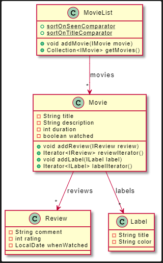
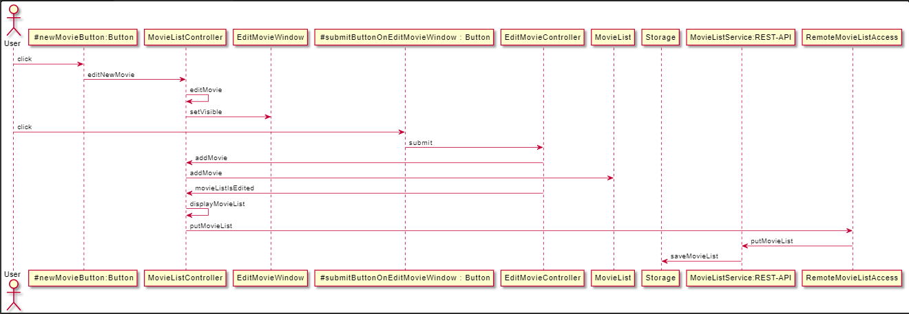

# Release 3

## Dokumentasjon for release 3:

- [Innledning](#innledning)
- [Implementasjon av labels](#implementasjon-av-labels)
- [Implementasjon av API](#implementasjon-av-api)
- [Getter som returnerer iterator istedenfor kopi av liste](#getter-som-returnerer-iterator-istedenfor-kopi-av-liste)
- [run-with-server script](#run-with-server-script)
- [Integrationtesting](#integrationtesting)
- [Klassediagram](#klassediagram)
- [Sekvensdiagram](#sekvensdiagram)
- [Accessklasser](#accessklasser)
- [Shippable product](#shippable-product)
- [Gitignore og .vscode](#gitignore-og-vscode)
- [Pipeline](#pipeline)

## Innledning

I release 3 har vi opprettet et REST-API, og laget støtte for dette i Appen. Vi utvidet logikken ved å implementere emneknagger for filmene. Videre har vi gjort endringer utifra tilbakemeldingen vi har fått, og generelt gjort koden mer ryddig. De tingene som vi ikke har nevnt i denne releasen er uendret og skrevet om i release 2.

## Implementasjon av labels

I release 2 hadde vi planer om å implementere emneknagger til en film, men gikk bort fra det, da vi fant ut at vi hadde nok implementasjon fra før av. Vi bestemte oss dermed for å implementere emneknagger i denne releasen, da vi allerede hadde en konseptuell modell for hvordan det ville se ut, og at vi allerede hadde implementert en del av logikken i release 2.

### Problemer ved implementasjon av labels

Da vi skulle implementere `Label` hadde vi problemer med hvordan strukturen skulle se ut. Én `Label` skulle ha mange `Movie`-objekter, og én `Movie` skulle også ha mange `Label`-objekter. Dette skapte en mange-til-mange relasjon mellom `Movie` og `Label`. Vi var usikre på hvordan vi ville implementere denne strukturen. Relasjonen mellom `Movie` og `Label` ga oss også problemer med lagring. Vi var usikre på hvordan vi skulle lagre `Label`-objektene, da vi ville unngå å lagre og opprette samme objekt flere ganger.

Løsning 1:

Vi tenkte først at vi måtte ha en hovedliste i `MovieList`, som holdt styr på alle `Label`-objektene, og at et `Movie`-objekt skulle ha en liste med sine `Label`-objekt. Et nytt `Label`-objekt skulle opprettes om det ikke fantes i hovedlisten i `MovieList`. Da måtte vi lagre `Label`-objektet både i `MovieList`-en og i `Movie`-en med denne `Label`-en. Vi fant ut at dette både var tungvindt og unødvendig.

Løsning 2:

Vi beholdt idéen om at et `Movie`-objekt skulle holde på sine `Label`-objekter. Så lagde vi en metode i `MovieList` kalt `getAllLabels`, som går gjennom alle `Movie`-objektene og finner alle `Label`-objektene. Da slapp vi å lagre `Label`-objektene både i `MovieList` og i `Movie`. Denne løsningen gikk vi for.

Lagring av Labels:

Vi hadde også som nevnt utfordringer med å lagre `Label`-objektene til fil, fordi vi ikke ville lagre samme objekt flere ganger. Derfor bestemte vi oss for å lagre `Label`-objektene først, og så lagre en liste men navnene på `Label`-objektene for hver `Movie`-objekt. Når vi da skal deserialisere et `Movie`-objekt matcher vi bare navnet med `Label`-objektet som allerede er deseralisert i et HashMap med navnet som nøkkel, og legger det til i `Movie`-objektet.

## Implementasjon av API

Vi har benyttet oss av Jersey for bygging og konfigurering av serveren. Videre har vi brukt Jakarta for å definere og håndtere http requests (PUT, GET). API requestene støtter JSON format. Vi valgte å benytte oss av PUT request, og ikke POST, fordi vi ville oppdatere ressursen, og ikke lage en ny for hvert kall.

Vi har tre request-metoder for behandling av server. Vi har:

`GET /movielist` - Dette er en get-metode som tar inn serveren i JSON format, og oppretter et `MovieList`-objekt ved hjelp av våre definerte deserialiserere. Den eneste gangen denne metoden blir kalt er under oppstart. Dette gjør vi fordi appen trenger hele `MovieList`-objektet ved oppstart, da vi vil vise alle filmene lagret på serveren med en gang under oppstart. Objektet blir lagret som et felt i `MovieListController`, når en endring skjer på `MovieList`-objektet vil metoden `putMovieList` bli kalt og JSON filen på serveren oppdatert.

`GET /movielist/{movieTitle}` - Dette er en get-metode som henter ut en film ved hjelp av tittel. Denne benyttes ikke i appen, men var grei å ha under testing i Postman.

`PUT /movielist` - Denne metoden oppdaterer JSON formatet på server med tilhørende `MovieList` som blir sendt inn som parameter.

### PUT /movielist

#### Request-body eksempel:

```json
{
  "labels": [
    {
      "title": "Action",
      "color": "#58E5EB"
    },
    {
      "title": "Eventyr",
      "color": "#314677"
    }
  ],
  "movies": [
    {
      "title": "Dette er en film",
      "description": "Flott film",
      "duration": 122,
      "watched": true,
      "labels": ["Action", "Eventyr"],
      "reviews": [
        {
          "comment": "Kjempegøy",
          "rating": 3,
          "whenWatched": "2021-11-05"
        }
      ]
    },
    {
      "title": "Film2",
      "description": "Kjempespennende",
      "duration": 122,
      "watched": false,
      "labels": ["Action"],
      "reviews": []
    }
  ]
}
```

#### Response-body eksempel

Dersom vellyket

```
true
```

Ellers

```
false
```

### GET /movielist

#### Response-body eksempel:

```json
{
  "labels": [
    {
      "title": "Action",
      "color": "#58E5EB"
    },
    {
      "title": "Eventyr",
      "color": "#314677"
    }
  ],
  "movies": [
    {
      "title": "Dette er en film",
      "description": "Flott film",
      "duration": 122,
      "watched": true,
      "labels": ["Action", "Eventyr"],
      "reviews": [
        {
          "comment": "Kjempegøy",
          "rating": 3,
          "whenWatched": "2021-11-05"
        }
      ]
    },
    {
      "title": "Film2",
      "description": "Kjempespennende",
      "duration": 122,
      "watched": false,
      "labels": ["Action"],
      "reviews": []
    }
  ]
}
```

### Ugunstig lagring til server

`putMovieList` - metoden lagrer hele `movieList`-objektet mellom hver gang det skjer en endring i objektet. Dette er kostbart, men nødvendig når vi bruker JSON. Dette kunne vært unngått om vi hadde benyttet oss av en annen form for database, og ikke en JSON-fil.

## Getter som returnerer iterator istedenfor kopi av liste

I release 2 returnerte vi en ny kopi av listene reviews og labels da metodene `getReviews()` og `getLabels` ble kalt på i `Movie`-klassen. Det å lage en ny liste for hver gang man kaller på disse funksjonene er kostbart, og kan være veldig kostbart hvis vi hadde hatt mange `Review`-objekter og `Label`-objekter i disse listene. For å gjøre det mindre kostbart returnerte vi istendenfor en iterator av listene, for å samtidig beholde god innkapsling. Å returnere en iterator tar ikke noe mer plass i minner, og gjør det dermed mindre kostbart enn å lage en kopi for hver gang man skal gjøre et kall på funksjonen.

Vi gjorde den samme endringen for funksjonen `getMovies` i `MovieList`-klassen, med samme argumentasjon.

## run-with-server script

Dette scriptet brukes for å starte serveren APIet kjører på og selve appen med samme kommando. Vi har laget dette for å forenkle kjøring av appen med RemoteAccess. Ettersom serveren og appen starter samtidig må man koble til ved hjelp av knappen oppe i høyre hjørne for å få tilgang til data fra APIet. Det er viktig å huske på at man må stoppe serveren etter at man har brukt den, for kommandoen kan ikke brukes om serveren allerede er på. Man kan stoppe serveren ved å utføre kommandoen `CTRL + C` i git bash-vinduet som kommer opp.

## Integrationtesting

I integrationtests-mappen finner man blant annet _AppIT.java_ (AppIntegrationTest). Integrasjonstesten starter opp en applikasjon og en server og kobler applikasjonen til serveren. Videre sjekker den at riggingen av en slik kombinasjon funker, uten å måtte teste noe særlig oppførsel i appen eller serveren.

### Starting og stopping av server i integrationtests

Du ser for eksempel at denne kodesnutten som ligger i pom.xml i integrationtests:

```
<execution>
	<id>reserve-port</id>
	<phase>pre-integration-test</phase>
	<goals>
		<goal>reserve-network-port</goal>
	</goals>
</execution>
```

Med pre-integration-test kallet, så startes serveren opp først, som gjør det mulig å starte appen gjennom AppIT som skal kobles til denne serveren. Og etter at testen er blitt gjennomført, må vi få stoppet serveren vi startet tidligere. Dett gjøres med post-integration-test kallet som man igjen finner i pom.xml slik:

```
<execution>
	<id>stop-jetty</id>
	<phase>post-integration-test</phase>
	<goals>
		<goal>stop</goal>
	</goals>
</execution>
```

Ved hjelp av maven så slipper vi å måtte skrive kommandoer for å starte og stoppe server og det skjer automatisk.

En slik test er det vi kan kaller for _System test_ fordi den tar for seg et helt system som vi har rigget opp. Men den er ikke en _Deployment test_ fordi den tester ikke hvordan serveren kommer til å bli brukt som en skytjeneste.

### Headless

I tillegg har vi lagt til en profil i pom-filen til integrationtests som legger til rette for å kunne kjøre AppIT `headless`. Denne profilen sørger for at vi kan kjøre testen uten å måtte få opp et vindu på skjermen. Hvis man kjører kommandoen `mvn verify -Pheadless` i `pmdb/integrationtests` vil man se at testen kjøres uten at et vindu dukker opp på skjermen.

Dette forutsetter at man har en statisk `supportHeadless()`-metode som kalles igjen i AppIT.java for å sette opp headless i testen vår:

```
@BeforeAll
public static void setupHeadless() {
	App.supportHeadless();
}
```

## Klassediagram

Klassediagrammet viser en litt mer utfyllende sammenhengen mellom de tre klassene `MovieList`, `Review` og `Label`. Diagrammet viser de ulike feltene i hver av klassene, og de viktigste metodene utenom gettere og settere. Alle feltene som er vist i klasse diagrammet er mulig å hentes ut ved hjelp av getter, og noen av de er mulig å settes også. Vi valgte å ikke ha med gettere og settere, for å gjøre diagrammet mindre rotete, og bare vise hovedlogikken og feltene. Vi valgte også å ikke ha med interfacene av samme grunn.



Diagrammet ligger også i mappen pmdb/core/src/main/java/core

## Sekvensdiagram

Sekvensdiagram viser flyten når en bruker vil legge til et nytt `Movie`-objekt til `MovieList`-objektet, fra brukeren trykker på å legge til en film, til filmen blir lagret på serveren ved hjelp av REST-APIet.



## Accessklasser

`MovieListAccess.java` er et interface som implementeres av klassene som brukes til å lagre og hente MovieList-en som brukes i appen. Interfacet har to metoder, getMovieList() og putMovieList(MovieList).

`RemoteMovieListAccess.java` er implementasjonen av interfacet som bruker API-et til å hente og lagre MovieList. Denne implementasjonen er den som initielt prøves å instansieres og brukes i MovieListController. Dersom objektet ikke får kontakt med serveren, blir i stedet `LocalMovieListAccess.java` instansiert og brukt i MovieListController. Dette skjer i praksis når serveren ikke kjører, og en får også beskjed om det i UI-et. Det er også en knapp i UI-et som når trykket på prøver å koble til serveren på nytt. Dersom det går blir igjen `RemoteMovieListAccess.java` brukt i MovieListController.

`LocalMovieListAccess.java` er altså en implementasjon av `MovieListAccess.java` som bruker en lokal fil for lagring, slik som i release 2, og har ingen knytning til filen som brukes til lagring i RemoteAccess-klassen.

Grunnen til at vi har valgt å implementere to forskjellige Access-klasser er slik at det skal være mulig å kjøre og bruke appen selv om serveren ikke kjører. Dette er nyttig spesielt i testing av appen, men gjør det også mulig for brukeren å ikke være avhengig av at serveren kjører.

### Testing av RemoteMovieListAccess.java

I testen, `RemoteMovieListAccessTest.java`, er det serveren som blir mocket (er "ikke-ekte"), i motsetning til rest-testen, der klienten er mocket.

Som man kan se på `@BeforeEach`-metoden, blir det startet en mockserver og er vi velger hvordan den skal svare på forespørsler:

```
URI uri = new URI("http://localhost:" + wireMockServer.port() + "/movielist");
remoteMovieListAccess = new RemoteMovieListAccess(uri);
```

I tillegg er det viktig å stoppe mockserveren etter enhver test i en `@AfterEach`-metode som vi har kalt `teardown()`.

```
@AfterEach
public void teardown() {
	wireMockServer.stop();
}
```

For å teste RemoteMovieListAccess-klassens `getMovieList()`, sender vi en reell forespørsel, men den går til mockserveren. Videre tester vi at MovieList-en vi får tilbake inneholder riktig informasjon (se `public void testGetMovieList()`).

`public void testPutMovieList()` skal teste `putMovieList()`-metoden fra RemoteMovieListAccess.java. Først tenkte vi å teste den ved å først ha en PUT etter en GET, men det vil ikke funke siden testen baserer seg på en mockserver.

Dermed endte vi opp med å teste om responsen håndteres riktig, og at det sendes en forespørsel på det formatet vi ønsker. Altså slik:

```
@Test
public  void  testPutMovieList()  {
	stubFor(put(urlEqualTo("/movielist")).withHeader("Accept", eq
ualTo("application/json"))
			.willReturn(aResponse().withStatus(200).withHeader("Content-Type", "application/json").withBody("true")));

assertTrue(remoteMovieListAccess.putMovieList(new  MovieList()));
}
```

## Shippable product

For å kunne eksportere appen som et 'shippable product' har vi brukt jlink og jpackage. Disse pakkene genererer en installasjonsfil som brukes til å installere appen lokalt på systemet.

## Gitignore og .vscode

I `.vscode` ligger det en fil som styrer hvordan VSCode vil formatere prosjekt-filene. Denne mappen kunne vært i gitignore-filen, siden den ikke har noe funksjonalitet for selve prosjektet, men heller hvordan kode vil formateres hos den enkelte utvikleren. Vi har likevel valgt å ikke ha denne mappen i `.gitignore`, slik at all kode formateres likt uavhengig av hvem som har skrevet den. Siden vi benytter oss av Checkstyle er dette også nyttig.

## Pipeline

For å sikre kodekvalitet ved mergerequests til main, lagde vi en gitlab pipeline, som utfører kommandoene `mvn compile` og `mvn verify` for `core`. Dette gjøres for å sikre at backenden ikke inneholder bugs ved merging til main.
