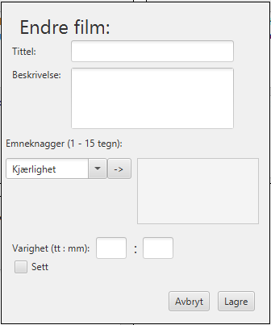

# Personal Movie Database (PMDB)
Personal movie database er et prosjekt i faget IT1901. Appen gir brukeren mulighet for lagre filmer og rangere filmer brukeren har sett. Dette gjør at brukeren har mulighet for å få finne filmer som personen har planlagt å se, og finne tilbake til filmer som brukeren synes var gode.

Appen har dermed to hovedfunksjonaliteter:
- Lagre filmer som brukeren skal se i fremtiden.
- Rangere filmer som brukeren har sett.

## Bygging og kjøring av prosjektet

Prosjektet er bygd på maven og må utføre kommandoer deretter.

Er du i rotmappen **gr2105** må du gå inn i mappen **pmdb** før du kan gå videre, kjør:

```
cd pmdb
```

### Kjøring av prosjektet
 

For å sette opp prosjektet, kjør:

```
mvn clean install
```

For å kjøre prosjektet, kjør:

```
mvn javafx:run
```

### Testing av prosjektet
For å kjøre alle testene, kjør:

```
mvn test
```

Hvis du bare vil kjøre de grafiske testene, kjør:

```
cd ui
mvn test
```

Hvis du bare vil kjøre backed testene, kjør:
```
cd core
mvn test
```

## Prototype
Under er det lagt ved bilder av prototypen:


Dette er bildet en bruker får opp når personen åpner appen. Øverst ser man faner der man kan enten velge å se "Min liste", "Vurderte filmer" eller "Alle filmer". Hvis man trykker på "Vurderte filmer" kommer man til en side der man kan se filmene som man har sett og er vurdert. Trykker man på "Min liste" kommer man til en siden som viser filmene man har lagt til, men ikke vurderte enda. Hvis man trykker "Alle filmer" kommer man til en side der man ser alle filmene, både de som er vurderte, og de som er i er i min liste.

På hver side har man muligheten for å bestemme hvilke filmer man vil se basert på en sjanger. 



Bildet viser
