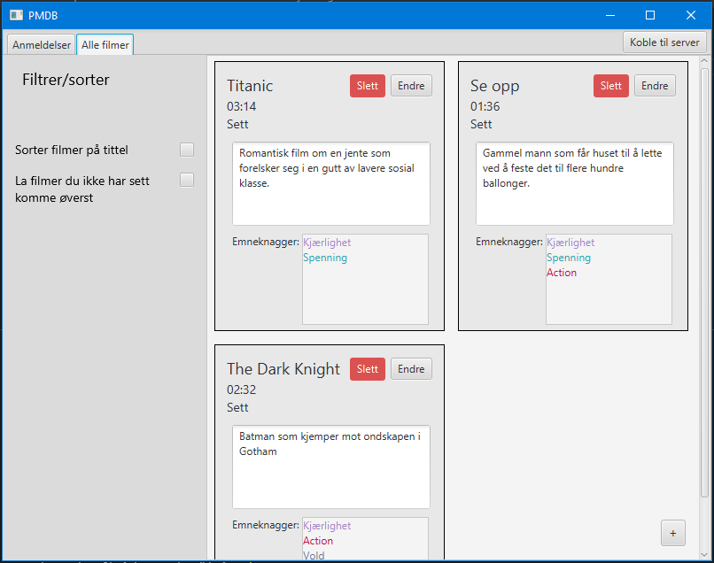
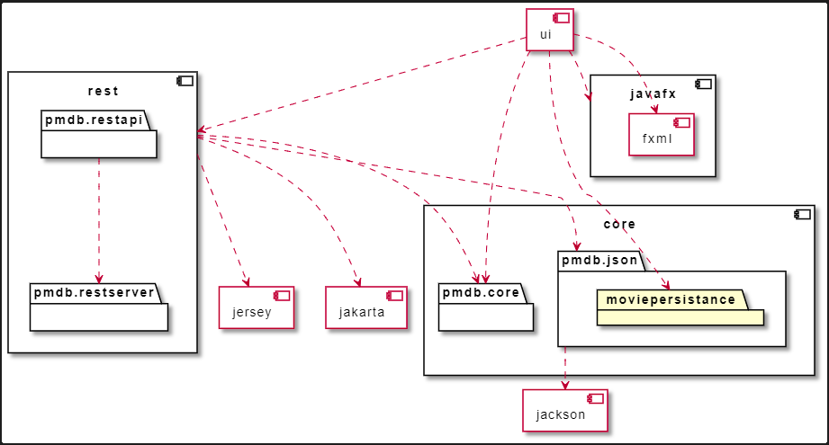

# Personal Movie Database (PMDB)
Personal movie database er et prosjekt i faget IT1901. Appen gir brukeren mulighet for lagre filmer og vurdere filmer brukeren har sett. Dette gjør at brukeren har mulighet for å få finne filmer som personen har planlagt å se, og finne tilbake til filmer som brukeren synes var gode.

Appen har dermed to hovedfunksjonaliteter:
- Lagre filmer som brukeren skal se i fremtiden.
- Vurdere filmer som brukeren har sett.

## Bygging og kjøring av prosjektet

Prosjektet er bygd på maven og må utføre kommandoer deretter.

Er du i rotmappen **gr2105** må du gå inn i mappen **pmdb** før du kan gå videre, kjør:

```
cd pmdb
```

### Kjøring av prosjektet


For å sette opp prosjektet, kjør:

```
mvn clean install
```

For å kjøre prosjektet, kjør:

```
cd ui
mvn javafx:run
```

### Testing av prosjektet
For å kjøre alle testene, kjør:

```
mvn test
```

Hvis du bare vil kjøre de grafiske testene, kjør:

```
cd ui
mvn test
```

Hvis du bare vil kjøre backend testene, kjør:
```
cd core
mvn test
```

## Appen

Under er flyten i appen beskrevet, med bilder og tilhørende tekst.

Bilde 1:



Bilde 1 viser hvordan appen ser ut når den blir åpnet. Der kan man legge til filmer som vist på figuren. Man legger til en film ved å trykke på *(+) - knappen* nederst til høyre i appen. Da vil man få opp et bilde (se bilde 2 under) som gir muligheten for å opprette en film.

Bilde 2:


Når man oppretter en film må man fylle ut feltene:
- Tittel
- Varighet
- Om filmen er sett
- Sammendrag av filmen

Man har mulighet til å både *endre* på en eksisterende film, og *slette* en eksisterende film. 

Hvis man trykker på *endre-knappen* kommer man til et bilde som er likt som når man trykker på *(+)-knappen* bare at feltene er fylt inn, og man har mulighet for å endre på de og lagre endringene.

På venstre har man mulighet til å trykke på checkboxer som sorterer filmene basert på:
- Tittel
- At filmer som du ikke har sett skal komme først

Disse sorteringene kan kombineres, slik at man både kan sortere på tittel og på om filmen er sett. Vi har gjort det slik at sorteringen på om filmen er sett trumfer sorteringen basert på tittel.


Bilde 3:


Bilde 3 viser hvordan siden for *Anmeldelser* ser ut. Her har man muligheten til å anmelde en eksisterende film, som ligger i *Alle filmer* (siden du startet på). Man lager en anmeldelse ved å trykke på *(+) - knappen* nederst til høyre i bildet. Da vil man få opp bildet under.


Når man anmelder en film må man fylle ut feltene:
- Film (en checkbox av filmobjekter man kan anmelde)
- Når filmen er sett
- Din rangering av filmen
- En kommentar til filmen.

Man har mulighet for å *endre* og *slette* en anmeldelse slik som man har med en film.


### Arkitektur:

