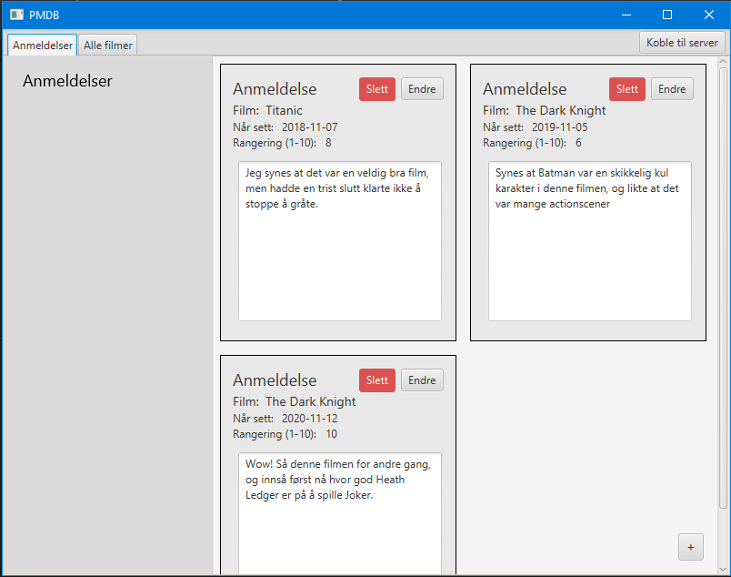

# Personal Movie Database (PMDB)

Personal movie database er et prosjekt i faget IT1901. Appen gir brukeren mulighet for lagre filmer og anmelde filmer brukeren har sett. Dette gjør at brukeren har mulighet for å finne filmer som personen har planlagt å se, og finne tilbake til filmer som brukeren synes var gode.

Appen har dermed to hovedfunksjonaliteter:

- Lagre filmer som brukeren skal se i fremtiden.
- Vurdere filmer som brukeren har sett.

## Bygging og kjøring av prosjektet

Prosjektet er bygd på maven og må utføre kommandoer deretter.

Er du i rotmappen **gr2105** må du gå inn i mappen **pmdb** før du kan gå videre, kjør:

```
cd pmdb
```

### Kjøring av prosjektet

For å sette opp prosjektet, kjør:

```
mvn clean install
```

Hvis man vil starte serveren, kan man utføre kommandoen:

```
mvn -pl integrationtests jetty:run -D "jetty.port=8999"
```

For å kjøre prosjektet, kjør:

```
cd ui
mvn javafx:run
```

Denne kommandoen må kjøres i en ny terminal hvis man har startet serveren. Man kan også kjøre appen uten å ha startet serveren.

Det er lurt å starte serveren, før man starter applikasjonen, men det er ikke nødvendig, da vi har lagt til støtte for å koble til serveren i appen.

Hvis man vil starte serveren og applikasjonen samtidig, kan man utføre kommandoen:

```
.\scripts\run-with-server.sh
```

Kommandoen må utføres fra `pmdb`-mappen.

Da kan det hende at appen ikke har koblet seg til serveren enda. Trykk på "Koble til server" for å koble til serveren.

Lukking av appen:

Ved lukking av appen er det viktig at man også skrur av serveren. Dette kan gjøres ved å utføre kommandoen `CTRL + C` i terminalen der serveren kjøres.

### Eksportere prosjektet til exe (Shippable product)

cd inn i ui og kjør `mvn clean compile javafx:jlink jpackage:jpackage`
For å installere appen kjører du `.exe` filen i ui/target/dist.
For å kjøre appen går du inn i C:\Program Files\pmdb og kjører `pmdb.exe`

### Testing av prosjektet

For å kjøre alle testene, kjør:

```
mvn test
```

Hvis du bare vil kjøre de grafiske testene, kjør:

```
cd ui
mvn test
```

Hvis du bare vil kjøre backend testene, kjør:

```
cd core
mvn test
```

### Bygging av prosjekt i GitPod

GitPod har problemer ved kjøring av programvare i parallelle tråder. Dette har innvirkning ved kjøring av ui-testene, da GUI-et og testene kjører i forskjellige tråder. Det er implementert metoder i testene for å minimalisere denne effetkten, men det er fremdeles muligheter for at det oppstår problemer. Dersom det blir et problem ved bygging av prosjektet kan det være lurt å gå inn i pmdb\ui\pom.xml og sette variabelen skipTests til true:

```
<properties>
    <skipTests>true</skipTests>
</properties>
```

---

## Appen

Under er flyten i appen beskrevet, med bilder og tilhørende tekst.

Bilde 1:


Bilde 1 viser hvordan appen ser ut når den blir åpnet. Der kan man legge til filmer som vist på figuren. Man legger til en film ved å trykke på _(+) - knappen_ nederst til høyre i appen. Da vil man få opp et bilde (se bilde 2 under) som gir muligheten for å opprette en film.

Bilde 2:


Når man oppretter en film må man fylle ut feltene:

- Tittel
- Varighet
- Om filmen er sett
- Sammendrag av filmen
- Emneknagger til filmen (dette er ikke nødvendig å fylle ut)

Man har mulighet til å både _endre_ på en eksisterende film, og _slette_ en eksisterende film.

Hvis man trykker på _endre-knappen_ kommer man til et bilde som er likt som når man trykker på _(+)-knappen_ bare at feltene er fylt inn, og man har mulighet for å endre på de og lagre endringene.

På venstre har man mulighet til å trykke på checkboxer som sorterer filmene basert på:

- Tittel
- At filmer som du ikke har sett skal komme først

Disse sorteringene kan kombineres, slik at man både kan sortere på tittel og på om filmen er sett. Vi har gjort det slik at sorteringen på om filmen er sett trumfer sorteringen basert på tittel.

Bilde 3:



Bilde 3 viser hvordan siden for _Anmeldelser_ ser ut. Her har man muligheten til å anmelde en eksisterende film, som ligger i _Alle filmer_ (siden du startet på). Man lager en anmeldelse ved å trykke på _(+) - knappen_ nederst til høyre i bildet. Da vil man få opp bildet under.


Når man anmelder en film må man fylle ut feltene:

- Film (en ComboBox av filmobjekter man kan anmelde)
- Når filmen er sett
- Din rangering av filmen
- En kommentar til filmen.

Man har mulighet for å _endre_ og _slette_ en anmeldelse slik som man har med en film, men anmeldelsen vil da være låst til den valgte filmen.

### Arkitektur:


